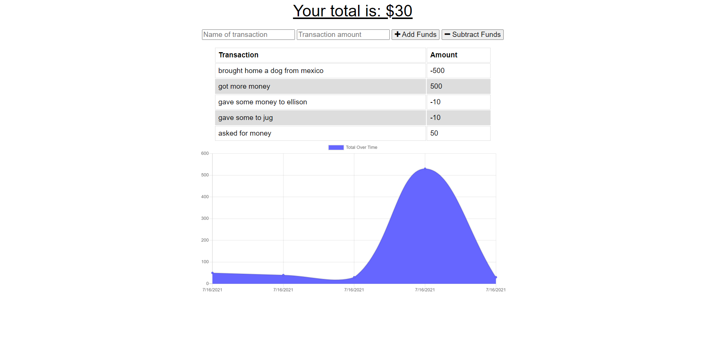
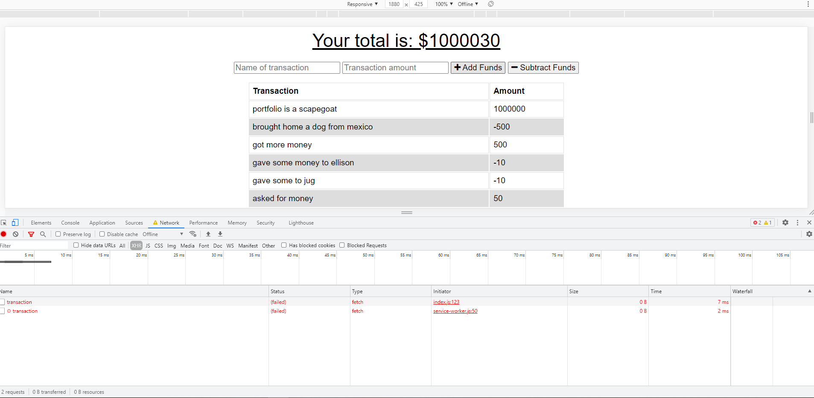

# Prog_budget

<h2> This is the mission: </h2>

<ul>

<li>Add functionality to our existing Budget Tracker application to allow for offline access and functionality.</li>

<li>The user will be able to add expenses and deposits to their budget with or without a connection. When entering transactions offline, they should populate the total when brought back online.</li>

<li>Offline Functionality:

  * Enter deposits offline

  * Enter expenses offline</li>

<li>When brought back online:

  * Offline entries should be added to tracker.</li>

  </ul>

# Table of Contents

*[What is asked.](#criteria)

*[Intel](#links)

*[Ain't she a beauty](#screenshots)

# Criteria: 
<ul>

<li>GIVEN a user is on Budget App without an internet connection</li>
<li>WHEN the user inputs a withdrawal or deposit
THEN that will be shown on the page, and added to their transaction history when their connection is back online.</li>

</ul>

# Links:

<h3>Github</h3>
<a href="https://github.com/Staycold/Prog_budget" target="_blank">https://github.com/Staycold/Prog_budget</a>

<h3>Heroku</h3>
<a href="https://warm-refuge-62095.herokuapp.com/" target="_blank">https://warm-refuge-62095.herokuapp.com/ </a>

 

# screenshots

